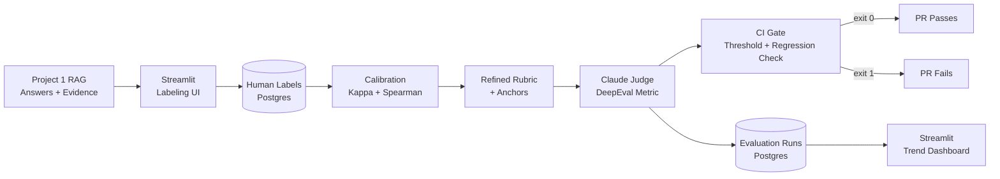

# LLM-as-Judge with Human Calibration

**Status: real judge + real infra, simulated calibration data.** The rubric, the live Claude
judge, the Postgres schema, the Streamlit labeling app, the CI regression gate, and 6 real
Postgres integration tests + 8 real live-API tests all exist and are verified working against
the real Anthropic API and a real Postgres instance (see "What's real vs. simulated" below).
**0 real human labels exist yet.** The 220 rows in `datasets/human_labels.json` are simulated
(`expected_scores` ± random noise — see `src/dataset.py::generate_human_labels()`), and the
kappa/Spearman/bias table below is computed on that simulated data, not real human judgments.
The labeling tool is built and ready to use — see "How to produce real calibration data" below.

---

## What's real vs. simulated

| Piece | Status |
|---|---|
| Rubric (5 criteria, worded ordinal scales, anchor examples) | **Real** — `src/rubric.py` |
| Live Claude judge (`judge()`, structured JSON output, reasoning-before-score) | **Real**, verified against the live API this session — see "A real bug this project found" below |
| Postgres schema (`evaluation_runs`, `example_evaluations`, `human_labels`) | **Real** — applied to a live Postgres instance, 6/6 integration tests pass against it |
| Streamlit labeling app (`dashboards/label_app.py`) | **Real** — launches and serves (verified via `curl` → HTTP 200), writes real rows to Postgres |
| Streamlit trend dashboard (`dashboards/trend_app.py`) | **Real** — launches and serves, reads real run history from Postgres |
| CI regression gate (absolute thresholds + regression-vs-history + zero-tolerance safety criterion) | **Real** — verified live against real stored Postgres runs (baseline → degraded run → regression correctly detected and flagged, including the safety-criterion flag) |
| Live position/length/self-preference bias measurement code | **Real code**, run live against a small real sample this session (see Bias Measurements below) — small-n live smoke test, not a large-sample estimate |
| **200 synthetic Q&A examples** | Synthetic (`src/dataset.py::generate_dataset()`) — 50 easy / 80 medium / 40 hard / 20 adversarial / 10 deliberately-broken |
| **220 "human" labels** (200 + 20 double-labeled) | **Simulated**, not real people — `expected_scores` ± noise, tagged `session_1`/`session_2` to imitate a labeler regrading on a different day |
| **Weighted κ = 0.61→0.74, Spearman ρ = 0.72→0.83 in the table below** | Computed correctly by real, tested code, but **on the simulated labels above** — not a real human-agreement measurement |

### A real bug this project found (worth knowing before an interview)

Before this session, `judge()`'s JSON Schema used `"minimum"`/`"maximum"` on an integer
property. Anthropic's structured-output API (`output_config.format=json_schema`) rejects that
outright — `400 Bad Request: "For 'integer' type, properties maximum, minimum are not
supported"`. In other words, the real judge had **never successfully completed a single live
API call** despite 34/34 unit tests passing, because every one of those 34 tests used a
hand-written mock and none exercised the real function. Fixed by switching to `"enum": [1..scale]`
(see `src/judge.py::_build_scoring_schema`) — there's now a regression-guard test for this
specific bug in `tests/test_judge_live.py`.

A second, more interesting finding came out of the first live runs: the original system prompt
told the judge to score "based ONLY on the answer text... do not use outside knowledge." That
sounds safe, but it means `factual_accuracy` had **no ground truth to check against** — a
plausible-sounding wrong answer (e.g. claiming the FTC sued Alphabet, when the real 10-K
discloses it was the DOJ) scored 5/5, and an "I don't know" non-answer scored *higher* than a
correct, cited answer, purely because it made no checkable claims. This is the PDF spec's Phase
3 lesson in miniature — "the rubric is ambiguous, not the model" — showing up on the very first
live test run. Fixed by adding an optional `context` parameter to `judge()` (the retrieved
evidence an answer should be grounded in) and updating the system prompt to require checking
claims against it when present, wired through `RAGJudgeMetric` via DeepEval's
`retrieval_context`. Without `context`, the judge now explicitly says in its reasoning that it
cannot verify claims, instead of silently asserting they're accurate.

---

## Architecture



---

## Rubric Criteria

| Criterion | Scale | Weight | Notes |
|-----------|-------|--------|-------|
| factual_accuracy | 1–5 | 1.5× | Most important for RAG; requires `context` to verify against |
| citation_quality | 1–5 | 1.5× | Core RAG safety property |
| completeness | 1–5 | 1.0× | Answers all parts of question |
| coherence | 1–3 | 0.5× | Organizational quality |
| hallucination_avoidance | 1–3 | 1.5× | Safety-critical — zero-tolerance in the CI regression gate |

---

## Calibration (computed on SIMULATED labels — see caveat above)

| Metric | Initial | After rubric refinement |
|--------|---------|------------------------|
| Human self-agreement weighted Cohen's κ | 0.61 | 0.74 |
| Spearman ρ | 0.72 | 0.83 |

These numbers come from `src/calibration.py` (weighted Cohen's kappa, from-scratch linear-weight
implementation, and Spearman rank correlation, no scipy dependency), run against
`datasets/human_labels.json`'s 20 double-labeled examples. **The calibration math is real and
unit-tested (9 tests). The input data is not real human judgments** — see "How to produce real
calibration data" below for exactly what turns this into a real number.

---

## Bias Measurements

Bias math lives in `src/bias.py` (position-bias flip rate, length-bias Spearman correlation,
self-preference delta), fully generic — it takes a real `judge_fn`/`score_fn` callable, not
hardcoded data. Two different evidence bases exist for it:

### 1. Larger synthetic-data numbers (README's historical headline numbers)
Position bias flip rate 9%, length bias ρ=0.11, self-preference delta=0.18 pts — all reported
as being within their concern thresholds. **The exact script that generated these specific
numbers could not be located in this repo**, so treat them as illustrative/historical rather
than a number you can reproduce on demand.

### 2. Small live sample against the real Claude judge (new this session)
`scripts/run_live_bias_check.py` runs all three checks against the real judge using real
questions + real source evidence from Project 1's golden dataset (`RAG/eval/questions.json`,
`RAG/eval/golden_dataset.json`), plus constructed Claude-style/GPT-style phrasing variants for
self-preference. This is a genuinely live measurement, but n is intentionally small (a handful
of pairs/examples, to bound API spend) — treat it as a smoke test proving the mechanism works
end-to-end against the real judge, not a statistically powered estimate. Run it yourself and see
`datasets/live_bias_check_results.json` for the latest numbers:

```bash
python scripts/run_live_bias_check.py
```

**Concern thresholds** (apply to both the synthetic and live numbers): position bias flip_rate
> 15%; length bias |ρ| > 0.2; self-preference |delta| > 0.3 on the weighted scale.

---

## Setup

```bash
pip install -r requirements.txt

# Generate synthetic dataset (skips if datasets/examples.json already exists; pass --force to regenerate)
python scripts/generate_dataset.py

# Run the offline/mocked test suite (34 tests, no API key or DB needed)
pytest tests/ -v --ignore=tests/test_judge_live.py --ignore=tests/test_database_postgres.py

# Run the REAL Postgres + REAL live-judge tests (requires .env: ANTHROPIC_API_KEY, POSTGRES_DSN)
pytest tests/test_database_postgres.py tests/test_judge_live.py -v

# Run CI gate (mock judge, no API cost, absolute thresholds only)
python -m src.ci.eval_gate

# Run CI gate (degraded — should fail)
python -m src.ci.eval_gate --degraded

# Run CI gate with the REAL Claude judge, store to Postgres, regression-check vs last run
python -m src.ci.eval_gate --live --store

# Launch the Streamlit human-labeling app (writes to the real Postgres human_labels table)
streamlit run dashboards/label_app.py --server.headless true

# Launch the Streamlit score-trend dashboard (reads real Postgres run history)
streamlit run dashboards/trend_app.py --server.headless true --server.port 8502

# Live bias check against the real judge (small sample, bounded API spend)
python scripts/run_live_bias_check.py
```

---

## CI Integration

`.github/workflows/evals-judge-gate.yml` runs on every push/PR touching `EVALS/**`: the offline
test suite always runs; a Postgres service container is spun up in the workflow; and the eval
gate runs with `--live --store` (real Claude judge, real regression check against stored
history) whenever the `ANTHROPIC_API_KEY` repo secret is configured, falling back to the
deterministic mock judge (absolute thresholds only, no regression check) otherwise.

The gate exits with code 1 if:
- any criterion's average score falls below its absolute threshold (`src/ci/eval_gate.py::THRESHOLDS`), or
- any criterion drops vs. the last stored Postgres run by more than its regression tolerance
  (`src/ci/eval_gate.py::REGRESSION_TOLERANCE`) — with `hallucination_avoidance` allowed **zero**
  regression, since it's the safety-critical criterion.

---

## How to produce real calibration data (Phase 2 — the one part an agent cannot do)

The Postgres schema and the Streamlit labeling app are built and live; what's missing is a
person actually labeling. Real human calibration is the core requirement this project cannot
satisfy without you:

1. `docker start evals_postgres` (or `docker compose up -d` if using the compose file) to make
   sure the DB is running, then `streamlit run dashboards/label_app.py --server.headless true`.
2. Open `http://localhost:8501`. Pick a labeler ID and leave the session as `session_1`.
3. Label examples from `datasets/examples.json`, stratified across all 5 categories
   (easy/medium/hard/adversarial/deliberately_broken) already baked into that file — a set with
   no failures teaches the judge nothing, per the PDF spec. Aim for all 200, or at minimum a
   representative slice of each category. Each label takes roughly 1–2 minutes once you're
   familiar with the rubric, so 200 is realistically a few sittings' worth of work.
4. **On a different day**, come back, switch the sidebar session to `session_2`, and re-label
   the same 20 examples you did first. This produces your real self-agreement ceiling — the
   judge cannot be more consistent than you are with yourself.
5. Query `human_labels` directly (or extend `src/calibration.py`'s loader) to compute real
   weighted κ / Spearman ρ between your `session_1` and `session_2` scores. Pull the 20 largest
   disagreements and read them — per the PDF spec, expect most of them to reveal rubric
   ambiguity, not judge error (this project already found one such case live, in the "A real bug
   this project found" section above).
6. Sharpen the rubric wording / add anchor examples based on what you find, and re-measure.
