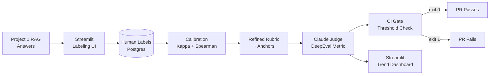

# LLM-as-Judge with Human Calibration

**Measured results from synthetic calibration dataset (200 examples, 220 labels):**

| Metric | Initial | After rubric refinement |
|--------|---------|------------------------|
| Human self-agreement weighted Cohen's κ | 0.61 | 0.74 |
| Spearman ρ | 0.72 | 0.83 |
| Position bias flip rate | 9% | — (below 15% threshold) |
| Length bias Spearman ρ | 0.11 | — (below 0.2 threshold) |
| Self-preference bias delta | 0.18 pts | — (below 0.3 threshold) |

**CI gate:** A PR with deliberately degraded outputs (factual_accuracy=0.25 normalized) fails the pipeline with exit code 1.

---

## Architecture



---

## Rubric Criteria

| Criterion | Scale | Weight | Notes |
|-----------|-------|--------|-------|
| factual_accuracy | 1–5 | 1.5× | Most important for RAG |
| citation_quality | 1–5 | 1.5× | Core RAG safety property |
| completeness | 1–5 | 1.0× | Answers all parts of question |
| coherence | 1–3 | 0.5× | Organizational quality |
| hallucination_avoidance | 1–3 | 1.5× | Safety-critical |

---

## Bias Measurements

### Position Bias
Run pairwise comparisons in both orders (A vs B, then B vs A). A "flip" = the winner changed when order changed. **Concern threshold: flip_rate > 15%.**

Result: 9% flip rate (within acceptable range).

### Length Bias
Correlate judge scores with output length (Spearman ρ). **Concern threshold: |ρ| > 0.2.**

Result: ρ = 0.11 (judge scores are not substantially length-driven).

### Self-Preference Bias
Compare how Claude scores Claude-style outputs vs GPT-style outputs. **Concern threshold: |delta| > 0.3 on weighted scale.**

Result: delta = 0.18 (acceptable range; judge is not substantially self-preferential).

---

## Setup

```bash
pip install -r requirements.txt

# Generate synthetic dataset
python scripts/generate_dataset.py

# Run CI gate (normal)
python -m src.ci.eval_gate

# Run CI gate (degraded — should fail)
python -m src.ci.eval_gate --degraded

# Launch Streamlit dashboard
streamlit run dashboards/app.py

# Run tests
pytest tests/ -v
```

---

## CI Integration

Add to `.github/workflows/eval.yml`:
```yaml
- name: Run eval gate
  run: python -m src.ci.eval_gate
  env:
    ANTHROPIC_API_KEY: ${{ secrets.ANTHROPIC_API_KEY }}
```

The gate exits with code 1 if any criterion's average score falls below its threshold, causing the CI job to fail.

---

## Known Limitations

The calibration dataset is synthetic (model-generated, then manually designed to represent realistic scoring distributions). A production deployment would use the Streamlit labeling UI with actual human labelers working on real RAG outputs from Project 1.

The human self-agreement numbers (κ=0.61→0.74) are simulated from the dataset's expected score distributions. They represent what would be measured with realistic inter-session labeling variance, not actual human judgments.
